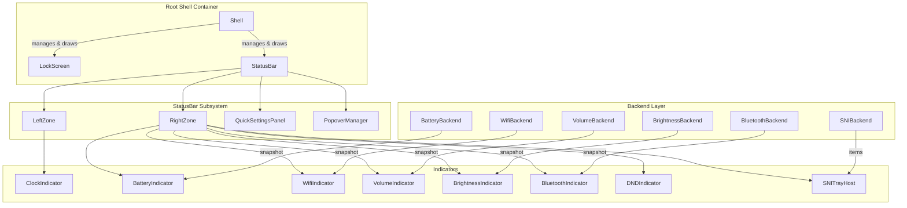

# Status Bar — Design & Architecture

## Overview

A **fully extensible status bar** anchored to the top edge of the lockscreen,
providing system indicators (Clock, Battery, WiFi, Volume, Brightness,
Bluetooth, Do Not Disturb) and a **Quick Settings panel** for rapid toggle
access. The design draws from three mature desktop shell implementations:

| Desktop | Component | Key Ideas Borrowed |
|---------|-----------|--------------------|
| **KDE Plasma** | Panel + Plasmoids | Corona → Containment → Applet hierarchy; DataEngine / Model-View separation; compact + full representation per widget; `StatusNotifierItem` D-Bus protocol for third-party tray icons |
| **GNOME Shell** | Top Bar + Quick Settings | Three-zone panel (left / center / right); `SystemIndicator` → `QuickToggle` / `QuickMenuToggle` tile pattern; `PanelMenu.Button` for extensible status area |
| **ChromeOS Ash** | Shelf + Unified System Tray | Tray View → Default View → Detailed View hierarchy; `UnifiedSystemTrayModel` state machine; Material You tile grid; modular `ash/system/` controllers |

The status bar is always visible and survives the reveal/dim state machine
(drawn at reduced opacity when idle). It draws **no chrome of its own** — no
background strip, no border: the indicators sit directly on the lockscreen
background (shadowed text, like the lockscreen clock), so bar and lockscreen
are one continuous surface rather than two stacked panels.

```
┌───────────────────────────────────────────────────────────────────────┐
│   Mon Jul 12   3:45 PM                          🔅  🔇  📶  🔋  ⚙    │
│                                                                       │
│         Lockscreen content (clock, password, media, etc.)             │
│                                                                       │
└───────────────────────────────────────────────────────────────────────┘
                                 ↓ click ⚙
┌─────────────────────────────────────────────┐
│  ┌──────────┐  ┌──────────┐  ┌──────────┐  │
│  │ 📶 WiFi  │  │ 🔵 BT    │  │ 🌙 DND   │  │
│  │   On     │  │   Off    │  │   Off    │  │
│  └──────────┘  └──────────┘  └──────────┘  │
│  ━━━━━━━━━━━━━━━━━━━━━━━━━━━━ 🔆 75%       │
│  ━━━━━━━━━━━━━━━●━━━━━━━━━━━ 🔊 60%        │
│  ─────────────────────────────────────────  │
│  ⏱ Battery 87% — 2:30 remaining            │
└─────────────────────────────────────────────┘
```

---

## Design Principles

1. **Strict Decoupling (LockScreen ⟂ StatusBar)** — The lockscreen and the
   status bar are siblings that never reference each other. This is the
   project's structural non-negotiable:
   - `Shell` is the **sole composition point**: it owns both, draws both,
     and routes input between them. Neither child names, includes, or
     shares state with the other.
   - StatusBar code (`ui/statusbar/`, `ui/indicators/`, `system/`) may
     depend only on shared foundations: `EventLoop`, `Painter`, `Theme`,
     `Widget`, and the narrow `Invalidator` interface. It must never see
     lock-specific code (PAM, `LockSession`, `RenderHost::requestUnlock`).
   - Consequence: the bar remains hostable outside the lockscreen (e.g. a
     future layer-shell `qypr-bar`) without surgery, and either subsystem
     can be built, tested, and reasoned about alone.

2. **Minimal Footprint** — qypr's founding objective is minimum memory and
   process count; the status bar must not erode it:
   - **No new processes.** Backends never shell out (`wpctl`, `pactl`,
     etc.) — they use in-process, event-driven APIs.
   - **Push, not poll.** Backends subscribe (D-Bus `PropertiesChanged`,
     protocol events) and put their fds in the epoll `EventLoop`; a
     synchronous fetch is allowed once at startup only.
   - **One bus connection per bus.** All system-bus backends (UPower,
     NetworkManager, BlueZ, logind) share a single `sd_bus` connection
     owned by `SystemBackends`; likewise for the session bus.
   - **Lazy init.** Backends are constructed only when the bar is enabled.

3. **Plugin Architecture** — Every indicator is a self-contained module
   (backend + widget) that registers itself with the bar at startup.
   Adding a new indicator requires zero changes to StatusBar itself.
   *(Inspired by KDE Plasma's Containment/Applet and GNOME's
   `SystemIndicator` pattern.)*

4. **Backend / Frontend Separation** — System state is monitored by backend
   classes (`*Backend`) that produce immutable snapshot structs and notify
   on change. UI indicator classes (`*Indicator`) consume snapshots and
   render. *(Inspired by KDE DataEngines and ChromeOS `ash/system/`
   controllers.)*

5. **Three-Layer View Hierarchy** — Each indicator exposes up to three
   representations, following ChromeOS Ash conventions:
   - **Tray View** — Compact icon in the status bar strip.
   - **Default View** — Summary shown inside the Quick Settings panel.
   - **Detailed View** — Full interactive popover (sliders, lists, etc.)

6. **Quick Settings Panel** — A single expandable panel (like GNOME 43+
   Quick Settings / ChromeOS Unified Tray) that replaces per-indicator
   popovers for toggles. Click the gear icon ⚙ (or any toggle indicator)
   to open the shared Quick Settings panel containing all toggle tiles
   and sliders.

7. **StatusNotifierItem (SNI) Host** — Optional support for the
   freedesktop `StatusNotifierItem` D-Bus protocol, allowing third-party
   applications to register tray icons. *(KDE Plasma's standard protocol,
   de facto Linux tray standard.)*

---

## Architecture

### High-Level Hierarchy

```
Shell (Root UI Compositor — coordinates inputs, layouts, and global idle dimming)
├── LockScreen (Auth UI: Clock, PasswordField, AudioController, Notifications, PowerDialog)
└── StatusBar (Status Bar UI: zones, layout, popovers, quick settings)
    ├── LeftZone ─────────────────────────────────────────────
    │   └── ClockIndicator          POSIX time, own formatting (no LockScreen code)
    │
    ├── RightZone ────────────────────────────────────────────
    │   ├── BrightnessIndicator     backlight via sysfs / logind D-Bus
    │   ├── VolumeIndicator         PipeWire / PulseAudio via wpctl or D-Bus
    │   ├── WifiIndicator           D-Bus: org.freedesktop.NetworkManager
    │   ├── BluetoothIndicator      D-Bus: org.bluez
    │   ├── BatteryIndicator        D-Bus: org.freedesktop.UPower
    │   ├── DNDIndicator            local state, notification suppression
    │   ├── SNITrayHost             StatusNotifierWatcher → third-party icons
    │   └── QuickSettingsButton     ⚙ opens the Quick Settings panel
    │
    ├── QuickSettingsPanel ───────────────────────────────────
    │   ├── ToggleTile[WiFi]        on/off + network name
    │   ├── ToggleTile[Bluetooth]   on/off + device count
    │   ├── ToggleTile[DND]         on/off
    │   ├── ToggleTile[NightLight]  on/off (future)
    │   ├── SliderTile[Brightness]  horizontal slider 0-100%
    │   ├── SliderTile[Volume]      horizontal slider 0-100% + mute
    │   └── StatusSummary           battery %, time remaining, profile
    │
    └── PopoverManager ───────────────────────────────────────
        └── DetailedPopover          only one open at a time
```

### Hosts: `qypr-lock` and `qypr-bar`

`StatusBar` depends only on `Invalidator` (repaint) and the `SystemBackends`
aggregate — never on the lock session, video, or PAM. That makes it hostable by
two separate binaries that share the whole object set and differ only in their
entry point and platform surface:

| | `qypr-lock` | `qypr-bar` |
|---|---|---|
| Host class | `App` (implements `RenderHost`) | `BarApp` (implements `Invalidator` + `InputSink`) |
| Platform | `WaylandDisplay` + `Output` on **ext-session-lock-v1** (fullscreen, secure) | `BarDisplay` + `BarWindow` on **wlr-layer-shell** (top-anchored panel, exclusive zone) |
| Composition | `Shell` (LockScreen ⟂ StatusBar peers) | StatusBar only — no LockScreen, video, or PAM |
| Session content | `setSessionContentVisible(false)` — WM widgets **hidden**, backends **not started** | `setSessionContentVisible(true)` — workspaces + active window **shown**, backends started |
| Chrome | chromeless (draws over the dark, dimmed lock video) | chromeless **+ subtle backdrop** (`setBackdrop`) so glyphs stay legible over any wallpaper |

`BarDisplay`/`BarWindow` are deliberate parallels of `WaylandDisplay`/`Output`
(the lock path is left untouched); they reuse the shared lower layers —
`ShmBuffer`, `Seat`, `Cursor`, `OutputEnv` and the throttled frame-callback
render loop. `Seat` was decoupled from the concrete `Output` via a
surface→logical-size resolver (`setSurfaceSizer`) so it feeds either host.

**Overlay grow.** The bar's layer surface is only the reserved strip tall
(`kReserved = 66px`) while idle, so the desktop below keeps its clicks. When
`StatusBar::hasOpenOverlay()` flips true (Quick Settings or a popover),
`BarApp` grows every `BarWindow` to the full output height so the overlay —
drawn at absolute coordinates, exactly as on the lock screen — is visible and
grabs input; it shrinks back on close. The exclusive zone stays at `kReserved`
throughout, so the overlay floats without reshuffling windows.

### Component Relationships



---

## Plugin / Indicator Registration System

Inspired by KDE Plasma's Corona/Applet model and GNOME's `addToStatusArea()`,
indicators register themselves at startup. The StatusBar never has a hard-coded
list of children.

```cpp
// Registry pattern — indicators self-register
class IndicatorRegistry {
public:
    static IndicatorRegistry& instance();

    // Register a factory. Zone determines left/right placement.
    using Factory = std::function<std::unique_ptr<StatusIndicator>(const SystemBackends&)>;
    void registerIndicator(const std::string& id, Zone zone, int priority, Factory factory);

    // StatusBar calls this once during construction
    std::vector<std::unique_ptr<StatusIndicator>> createAll(const SystemBackends& backends) const;

private:
    struct Entry {
        std::string id;
        Zone zone;
        int priority;       // lower = further left in its zone
        Factory factory;
    };
    std::vector<Entry> entries_;
};

// Macro for zero-boilerplate registration in each indicator's .cpp
#define REGISTER_INDICATOR(id, zone, priority, Type)                           \
    static const bool _reg_##Type = [] {                                       \
        IndicatorRegistry::instance().registerIndicator(                        \
            id, zone, priority,                                                \
            [](const SystemBackends& b) { return std::make_unique<Type>(b); }  \
        );                                                                     \
        return true;                                                           \
    }();
```

**Usage in indicator files:**

```cpp
// src/ui/indicators/BatteryIndicator.cpp
REGISTER_INDICATOR("battery", Zone::Right, 500, BatteryIndicator)
```

---

## Base Classes

### StatusIndicator (Applet / Widget)

Corresponds to KDE's Applet, GNOME's `SystemIndicator`, and ChromeOS's
tray item hierarchy with three representations.

```cpp
class StatusIndicator : public Widget {
public:
    virtual ~StatusIndicator() = default;

    // ─── Tray View (compact, always visible in bar strip) ───
    virtual std::string icon() const = 0;         // nerd font glyph
    virtual std::string label() const { return ""; }  // optional short text
    virtual std::string tooltip() const = 0;      // hover text
    virtual Color iconColor() const { return theme::color::text; }

    // ─── Default View (tile inside Quick Settings panel) ───
    // Return nullptr if this indicator has no Quick Settings tile.
    virtual std::unique_ptr<QSTile> createTile() { return nullptr; }

    // ─── Detailed View (full popover anchored to this indicator) ───
    virtual bool hasDetailedView() const { return false; }
    virtual std::unique_ptr<DetailedPopover> createDetailedView() { return nullptr; }

    // ─── Lifecycle ───
    virtual void poll(int64_t now) {}             // called on timer tick
    virtual void onBackendUpdate() {}             // called when snapshot changes
    virtual void onActivate() {}                  // click / Enter key

    // ─── Input (forwarded by StatusBar) ───
    virtual bool onScroll(double dx, double dy) { return false; }  // scroll-to-adjust

    // ─── State ───
    bool hovered = false;
    bool focused = false;       // keyboard focus
    Animated hoverScale_{1.0};
    Animated hoverAlpha_{0.0};

    // ─── Identification ───
    std::string id() const { return id_; }
    Zone zone() const { return zone_; }
    int priority() const { return priority_; }

protected:
    std::string id_;
    Zone zone_ = Zone::Right;
    int priority_ = 0;
};
```

### QSTile (Quick Settings Tile)

Inspired by GNOME's `QuickToggle` / `QuickMenuToggle` and ChromeOS's
tile grid:

```cpp
class QSTile {
public:
    virtual ~QSTile() = default;

    enum class Type { Toggle, Slider, Info };
    virtual Type type() const = 0;

    // Toggle tiles
    virtual std::string title() const = 0;
    virtual std::string subtitle() const { return ""; }
    virtual std::string icon() const = 0;
    virtual bool isActive() const { return false; }
    virtual void onToggle() {}

    // Slider tiles
    virtual double value() const { return 0.0; }
    virtual void onValueChange(double v) {}
    virtual std::string valueLabel() const { return ""; }

    // Draw
    virtual void draw(Painter& p, Rect bounds, int64_t now) = 0;

    Rect bounds;
    bool hovered = false;
    Animated hoverAnim_{0};
};
```

### DetailedPopover

Glass-morphism card with anchor arrow and dismiss logic:

```cpp
class DetailedPopover {
public:
    virtual ~DetailedPopover() = default;

    virtual void draw(Painter& p, int64_t now) = 0;
    virtual double contentHeight() const = 0;
    virtual double contentWidth() const { return 280.0; }

    // Input
    virtual bool handleClick(double x, double y) { return false; }
    virtual bool handleDrag(double x, double y) { return false; }
    virtual bool handleScroll(double dx, double dy) { return false; }
    virtual bool handleKey(uint32_t keysym) { return false; }

    // Anchor point (set by PopoverManager)
    double anchorX = 0, anchorY = 0;

    // Animation
    Animated openProgress_{0};   // 0=closed, 1=fully open
    bool isOpen() const { return openProgress_.target() > 0.5; }
    void open() { openProgress_.animate(1.0, theme::anim::fast); }
    void close() { openProgress_.animate(0.0, theme::anim::fast); }
};
```

### QuickSettingsPanel

The shared panel that aggregates all toggle/slider tiles. Inspired by
GNOME 43+ Quick Settings and ChromeOS Unified System Tray:

```cpp
class QuickSettingsPanel : public DetailedPopover {
public:
    void addTile(std::unique_ptr<QSTile> tile);

    void draw(Painter& p, int64_t now) override;
    double contentHeight() const override;
    bool handleClick(double x, double y) override;
    bool handleDrag(double x, double y) override;

private:
    std::vector<std::unique_ptr<QSTile>> tiles_;

    // Layout: tiles in a 3-column grid, sliders span full width below
    void layoutTiles();

    // Glass background
    void drawBackground(Painter& p) const;
};
```

---

## Layout Engine

### Three-Zone Panel Layout

Like GNOME's Left / Center / Right panel zones:

```
┌─────────────────────────────────────────────────────────────────────┐
│  LeftZone          │           CenterZone           │    RightZone  │
│  (Clock)           │         (future use)           │  (indicators) │
│  ←── flows right   │         ←── centered ──→       │  flows left →─│
└─────────────────────────────────────────────────────────────────────┘
```

The CenterZone is reserved for future use (e.g., media now-playing title).

### Geometry Constants

```cpp
namespace theme::statusbar {
    // Bar dimensions. Margins align with the lockscreen's content frame
    // (spacing::xlarge sides — same as the notification stack and power
    // column) so bar + lockscreen read as one integrated composition.
    inline constexpr double height         = 36.0;
    inline constexpr double topMargin      = spacing::large;   // 24
    inline constexpr double sideMargin     = spacing::xlarge;  // 48
    inline constexpr double cornerRadius   = 12.0;

    // Indicator spacing
    inline constexpr double iconSize       = 16.0;
    inline constexpr double iconSpacing    = 18.0;    // gap between indicators
    inline constexpr double padding        = 14.0;    // horizontal padding inside bar
    inline constexpr double separatorWidth = 1.0;     // vertical separator between zones

    // Quick Settings panel
    inline constexpr double qsPanelWidth   = 380.0;
    inline constexpr double qsTileSize     = 110.0;   // tile width in grid
    inline constexpr double qsTileHeight   = 64.0;
    inline constexpr double qsTileGap      = 8.0;
    inline constexpr double qsSliderHeight = 40.0;
    inline constexpr double qsPadding      = 16.0;
    inline constexpr double qsCornerRadius = 16.0;

    // Popover
    inline constexpr double popoverWidth   = 280.0;
    inline constexpr double popoverPadding = 16.0;
    inline constexpr double popoverRadius  = 12.0;
    inline constexpr double arrowSize      = 8.0;
}
```

### StatusBar Layout Algorithm

```cpp
void StatusBar::layout(int screenW, int screenH) {
    // 1. Bar strip spans full width with side margins
    double barY = theme::statusbar::topMargin;
    double barX = theme::statusbar::sideMargin;
    double barW = screenW - 2 * theme::statusbar::sideMargin;
    double barH = theme::statusbar::height;
    bounds = {barX, barY, barW, barH};

    // 2. Left zone: clock flows right from left edge
    double cx = barX + theme::statusbar::padding;
    for (auto& ind : leftIndicators_) {
        double w = ind->measureWidth();
        ind->bounds = {cx, barY, w, barH};
        cx += w + theme::statusbar::iconSpacing;
    }

    // 3. Right zone: indicators flow left from right edge
    double rx = barX + barW - theme::statusbar::padding;
    for (auto it = rightIndicators_.rbegin(); it != rightIndicators_.rend(); ++it) {
        double w = (*it)->measureWidth();
        rx -= w;
        (*it)->bounds = {rx, barY, w, barH};
        rx -= theme::statusbar::iconSpacing;
    }

    // 4. Quick Settings panel anchored below right zone
    if (qsPanel_ && qsPanel_->isOpen()) {
        qsPanel_->anchorX = barX + barW - theme::statusbar::qsPanelWidth;
        qsPanel_->anchorY = barY + barH + 4.0;
    }
}
```

---

## Indicator Specifications

### 1. Clock Indicator

| Property | Value |
|----------|-------|
| Zone | Left |
| Priority | 0 |
| Backend | None (POSIX `localtime_r`) |
| Tray view | `"Mon Jul 12   3:45 PM"` text |
| Quick Settings tile | None |
| Detailed popover | None |
| Update interval | Every 1 second via StatusBar's own tick — never LockScreen's clock timer |

- Font: `theme::font::family` at `theme::statusbar::iconSize`
- Formats time itself (`localtime_r` + `strftime`); shares no LockScreen
  widget code (decoupling principle 1)

---

### 2. Battery Indicator

| Property | Value |
|----------|-------|
| Zone | Right |
| Priority | 500 |
| Backend | `BatteryBackend` (UPower D-Bus) |
| Tray view | Battery icon + percentage text |
| Quick Settings tile | `Info` — percentage, time remaining, progress bar |
| Detailed popover | Full battery details + charging animation |

**BatteryBackend** — uses `sd-bus` on the **system** bus (UPower does not
live on the session bus), via the shared `SystemBackends` connection:

- Bus: `org.freedesktop.UPower`
- Path: `/org/freedesktop/UPower/devices/DisplayDevice`
- Properties: `Percentage`, `State`, `TimeToEmpty`, `TimeToFull`, `IsPresent`
- Signal: `org.freedesktop.DBus.Properties.PropertiesChanged` (reactive updates)
- Fallback: enumerate all devices, find `Type=2` (battery)

```cpp
struct BatterySnapshot {
    int percentage = 0;
    enum State { Unknown, Charging, Discharging, Full, PendingCharge } state = Unknown;
    bool present = false;
    int64_t timeToEmpty = 0;    // seconds
    int64_t timeToFull = 0;     // seconds
    double energyRate = 0.0;    // watts (power draw)
    std::string nativePath;     // e.g. "BAT0"
};
```

**Icons** (Nerd Font):

| Level | Discharging | Charging |
|-------|-------------|----------|
| 100% | `󰁹` | `󰂅` |
| 90% | `󰂂` | `󰂋` |
| 80% | `󰂁` | `󰂊` |
| 70% | `󰂀` | `󰢞` |
| 60% | `󰁿` | `󰂉` |
| 50% | `󰁾` | `󰢝` |
| 40% | `󰁽` | `󰂈` |
| 30% | `󰁼` | `󰂇` |
| 20% | `󰁻` | `󰂆` |
| 10% | `󰁺` | `󰢜` |
| 0% | `󰂎` | `󰢟` |

**Color coding:** green (>50%), yellow (20–50%), red (<20%)
**Charging animation:** pulsing glow on icon at 1Hz

**Detailed popover:**

```
┌─────────────────────────────────┐
│  Battery                  87%   │
│  ─────────────────────────────  │
│  ■■■■■■■■■■■■■■■■■■□□  87%     │
│                                 │
│  ⏱  2h 30min remaining         │
│  ⚡ 12.3W power draw            │
│  🔌 State: Discharging          │
└─────────────────────────────────┘
```

---

### 3. WiFi Indicator

| Property | Value |
|----------|-------|
| Zone | Right |
| Priority | 300 |
| Backend | `WifiBackend` (NetworkManager D-Bus) |
| Tray view | WiFi signal icon |
| Quick Settings tile | `Toggle` — on/off + SSID display |
| Detailed popover | Network details, signal strength bar |

**WifiBackend** — uses `sd-bus`:

- Bus: `org.freedesktop.NetworkManager`
- Path: `/org/freedesktop/NetworkManager`
- Enumerate devices → find WiFi (`DeviceType=2`) → read `ActiveAccessPoint`
- AccessPoint properties: `Ssid` (byte array), `Strength` (0-100), `Frequency`, `Flags`
- Properties signal for reactive updates
- Supports `WirelessEnabled` toggle via D-Bus method

```cpp
struct WifiSnapshot {
    bool enabled = false;
    bool connected = false;
    std::string ssid;
    int signalStrength = 0;     // 0-100
    int frequency = 0;          // MHz
    bool secured = false;
    std::string ipAddress;
};
```

**Icons:**

| State | Icon |
|-------|------|
| Strong (≥75%) | `󰤨` |
| Good (50–74%) | `󰤥` |
| Weak (25–49%) | `󰤢` |
| Very weak (<25%) | `󰤯` |
| Disconnected | `󰤭` |
| Disabled | `󰤮` |

**Quick Settings toggle tile:**

```
┌──────────────┐
│  󰤨  WiFi     │
│  MyHomeWiFi  │
└──────────────┘
```

Active state: `theme::color::primary` background
Inactive state: `theme::color::surface` background

---

### 4. Volume Indicator

| Property | Value |
|----------|-------|
| Zone | Right |
| Priority | 200 |
| Backend | `VolumeBackend` (PipeWire/PulseAudio) |
| Tray view | Volume icon |
| Quick Settings tile | `Slider` — horizontal volume slider + mute toggle |
| Detailed popover | Per-sink/source selection (future) |
| Scroll action | Scroll on icon adjusts volume ±5% |

**VolumeBackend** — in-process native client. Shelling out to `wpctl`/
`pactl` is forbidden: forking a process per update violates the
minimal-footprint objective (principle 2).

- libpulse async API against PipeWire's pulse server (`pipewire-pulse`)
- The `pa_context` fds integrate into the epoll `EventLoop` — event-driven,
  zero polling
- Read: sink-info callback at startup; subscribe with
  `PA_SUBSCRIPTION_MASK_SINK` for push updates thereafter
- Write: `pa_context_set_sink_volume_by_index` / `pa_context_set_sink_mute_by_index`

```cpp
struct VolumeSnapshot {
    double level = 0.0;         // 0.0–1.0
    bool muted = false;
    bool available = true;
    std::string sinkName;       // e.g. "Built-in Audio Analog Stereo"
    std::string sinkIcon;       // e.g. "audio-headphones"
};
```

**Icons:**

| Level | Icon |
|-------|------|
| High (≥66%) | `󰕾` |
| Medium (33–65%) | `󰖀` |
| Low (1–32%) | `󰕿` |
| Muted / 0% | `󰝟` |

**Quick Settings slider tile:**

```
┌──────────────────────────────────────────┐
│  󰕾  ━━━━━━━━━━━━━●━━━━━━  75%    󰝟     │
└──────────────────────────────────────────┘
```

- Drag to adjust; click mute icon toggles mute
- Writes volume back immediately via `wpctl set-volume`
- Scroll over tray icon adjusts ±5%

---

### 5. Brightness Indicator

| Property | Value |
|----------|-------|
| Zone | Right |
| Priority | 100 |
| Backend | `BrightnessBackend` (logind D-Bus / sysfs) |
| Tray view | Brightness icon |
| Quick Settings tile | `Slider` — horizontal brightness slider |
| Detailed popover | None |
| Scroll action | Scroll on icon adjusts brightness ±5% |

**BrightnessBackend** — dual-path:

1. **Primary (D-Bus via logind):**
   - Bus: `org.freedesktop.login1`
   - Path: `/org/freedesktop/login1/session/auto`
   - Interface: `org.freedesktop.login1.Session`
   - Method: `SetBrightness("backlight", <device>, <value>)`
   - This approach follows ChromeOS's `powerd` model of using a system
     daemon rather than writing sysfs directly.

2. **Fallback (sysfs direct):**
   - Read: `/sys/class/backlight/*/brightness` and `max_brightness`
   - Write: `/sys/class/backlight/*/brightness`
   - Requires permissions (polkit or suid helper)

```cpp
struct BrightnessSnapshot {
    int current = 0;            // raw hardware value
    int max = 0;                // max hardware value
    double percentage() const { return max > 0 ? 100.0 * current / max : 0; }
    bool available = false;
    std::string device;         // e.g. "intel_backlight"
};
```

**Icons:**

| Level | Icon |
|-------|------|
| High (≥66%) | `󰃠` |
| Medium (33–65%) | `󰃟` |
| Low (<33%) | `󰃞` |

**Quick Settings slider tile:**

```
┌──────────────────────────────────────────┐
│  󰃠  ━━━━━━━━━━━━━━━━●━━━  75%           │
└──────────────────────────────────────────┘
```

---

### 6. Bluetooth Indicator

| Property | Value |
|----------|-------|
| Zone | Right |
| Priority | 350 |
| Backend | `BluetoothBackend` (BlueZ D-Bus) |
| Tray view | Bluetooth icon (blue when active) |
| Quick Settings tile | `Toggle` — on/off + connected device count |
| Detailed popover | Device list with battery levels (future) |

**BluetoothBackend** — uses `sd-bus`:

- Bus: `org.bluez`
- Path: `/org/bluez/hci0`
- Interface: `org.bluez.Adapter1`
- Properties: `Powered`, `Discovering`, `Address`
- Enumerate `/org/bluez/hci0/dev_*` for connected devices
- Device interface: `org.bluez.Device1` → `Connected`, `Name`, `Icon`,
  `Battery` (via `org.bluez.Battery1`)

```cpp
struct BluetoothSnapshot {
    bool available = false;
    bool powered = false;
    bool discovering = false;
    int connectedCount = 0;
    struct Device {
        std::string name;
        std::string address;
        bool connected = false;
        int battery = -1;       // -1 = unknown
        std::string icon;       // "audio-headphones", "input-mouse", etc.
    };
    std::vector<Device> devices;
};
```

**Icons:**

| State | Icon |
|-------|------|
| On, connected | `󰂱` (blue accent) |
| On, idle | `󰂯` |
| Off | `󰂲` |

**Quick Settings toggle tile:**

```
┌──────────────┐
│  󰂱  BT       │
│  2 devices   │
└──────────────┘
```

---

### 7. Do Not Disturb (DND) Indicator

| Property | Value |
|----------|-------|
| Zone | Right |
| Priority | 400 |
| Backend | None — local state, published to Shell |
| Tray view | Moon icon (visible only when DND active) |
| Quick Settings tile | `Toggle` — on/off |
| Detailed popover | None |

The Desktop Notifications spec defines no DND API; every daemon-side DND
control interface is proprietary (SwayNC's `org.erikreider.swaync.cc`,
dunst's `org.dunstproject.cmd0`, ...). qypr depends only on freedesktop
standards — never on a particular daemon — so DND is **qypr-local state**:

- The indicator owns a plain on/off flag and exposes it (`dndActive()`).
- `Shell` — the sole composition point (principle 1) — reads that flag and
  suppresses the notification cards it forwards to the lockscreen while
  DND is on. Neither child references the other; it also must **not**
  reach into the lockscreen's `NotificationMonitor`.
- `NotificationMonitor` keeps observing throughout, so nothing is lost:
  when DND turns off, Shell pushes the accumulated set and the stack
  reappears.
- State lives for the lock session only (a fresh lock starts with DND
  off); no config file, no daemon round-trips.

```cpp
struct DNDSnapshot {
    bool enabled = false;
    int64_t enabledAt = 0;       // timestamp when enabled
    int64_t autoDisableAt = 0;   // 0 = indefinite
};
```

**Icons:**

| State | Icon |
|-------|------|
| DND Active | `󰽥` (accent color) |
| DND Off | (hidden from tray — only shown in QS panel) |

---

### 8. SNI Tray Host (StatusNotifierItem)  — implemented (host mode)

Support for the freedesktop/KDE **StatusNotifierItem** D-Bus protocol, so
third-party applications can display tray icons in the status bar.

*(The `org.kde.*` bus names are the protocol's historical spelling — SNI is
the de facto cross-desktop tray standard implemented by waybar, Plasma, etc.
It is a shared protocol, **not** a specific daemon's private interface, so
hosting it adds no dependency on KDE or any other desktop component — the same
native-only rule that governs the rest of the bar.)*

**Host mode.** SNI has three roles: Watcher, Host, and Item. Exactly one
Watcher may own `org.kde.StatusNotifierWatcher` per session; on a typical
setup another bar (waybar here) already owns it. `SNIBackend` therefore runs
purely as a **Host**: it claims `org.kde.StatusNotifierHost-<pid>-1`, calls
`RegisterStatusNotifierHost` on the existing Watcher, reads the Watcher's
`RegisteredStatusNotifierItems`, and mirrors that list. Claiming the Watcher
name ourselves is deferred to the standalone `qypr-bar` phase (where no other
bar is running); a `NameOwnerChanged` watch re-registers if the Watcher
restarts. This keeps two bars coexisting without fighting over the name.

**Push, one shared session connection.** `SNIBackend` lives on the shared
`SystemBus(BusKind::Session)` connection (the same object the future
session-bus backends use — one connection per bus). It subscribes to the
Watcher's `StatusNotifierItemRegistered`/`Unregistered` and to each item's
`org.kde.StatusNotifierItem` change signals; a per-item change refetches only
the signalling item (matched by sender + path), never the whole list.

```cpp
struct SNIItem {
    std::string service;   // owning bus name (e.g. ":1.48")
    std::string path;      // item object path (e.g. "/org/blueman/sni")
    std::string iconName;  // themed IconName ("" if only a pixmap is shipped)
    std::string title;     // Title (tooltip text)
    std::string status;    // "Active" | "Passive" | "NeedsAttention"
    cairo_surface_t* pixmap = nullptr;  // best IconPixmap → premultiplied cairo
};
```

**Icons.** The item's themed `IconName` is resolved through the shared
`IconResolver`, which now performs a proper freedesktop lookup — the active
icon theme plus its full `Inherits=` chain, searching every context
(`apps`/`status`/`devices`/`panel`/…) via each theme's `Directories=`. This is
what lets a tray status icon like nm-applet's `nm-signal-75` resolve through
theme inheritance (candy-icons → breeze) rather than only app icons. When a
name does not resolve, the app-supplied `IconPixmap` (ARGB, network byte
order) is converted to a premultiplied cairo surface as a fallback.

**Activation.** Left-click issues the item's `Activate(x, y)` (fire-and-forget
async). This works for items that implement it (e.g. blueman). Menu-only
items (nm-applet exposes only `SecondaryActivate`/`Scroll` + a
`com.canonical.dbusmenu`) need context-menu support, which is deferred to
Phase 6 polish along with async item fetch.

`SNITrayHost` renders one small icon per item in the right zone, just left of
the Quick Settings gear (chromeless, like every other indicator — no divider),
and maps a click to the icon under the pointer via the base
`StatusIndicator::onClick` hook.

---

### 9. Workspaces + 10. Active Window (WM widgets)  — session-sensitive

Compositor state widgets, built on standard Wayland protocols only — **no
`hyprctl`, no per-WM IPC**, so they work on Hyprland, Sway, river, and any
other compositor that implements the protocols.

| Widget | Protocol | Shows |
|--------|----------|-------|
| Workspaces (`WorkspacesIndicator`, left zone) | `ext-workspace-v1` (standard) | a pill per workspace, the active one accented, urgent tinted; click switches (`activate` + `commit`). Hidden workspaces are filtered per spec. |
| Active window (`ActiveWindowIndicator`, center) | `wlr-foreign-toplevel-management` (vendored) | the focused window's title (app id fallback), following keyboard focus |

The active window uses the wlr protocol, not the standard
`ext-foreign-toplevel-list-v1`, because the latter is list-only — it carries no
per-window *focus/activated* state, so it cannot answer "which window is
focused". The wlr protocol is the only broadly supported one that does.

Both backends (`WorkspaceBackend`, `ToplevelBackend`) bind their own registry
on the host's `wl_display`, so the same classes serve the lock screen and the
standalone `qypr-bar` — each just passes its display. Only `qypr-bar` actually
starts them (see below). Push only: the compositor streams workspace/toplevel
events on the existing display fd; a single startup roundtrip binds + seeds,
then everything is event-driven (no polling, no threads, no extra fd).

**Privacy gate (session-sensitive).** These widgets reveal what you are doing —
your workspace layout and the title of your focused window. Both override
`StatusIndicator::sensitive()` to return `true`, and `StatusBar` hides every
sensitive indicator unless the host opts in via `setSessionContentVisible(true)`
(all layout/draw/hit-testing goes through `StatusBar::isShown`). The lock screen
**never** enables it — and `qypr-lock` does not even start the WM backends — so
nothing about the session leaks on the locked bar. The unlocked `qypr-bar`
turns the gate on (`setSessionContentVisible(true)`) and starts the backends, so
the widgets appear there and only there. This is the one place a bar widget is
deliberately *absent* while locked. Verified live: the locked bar shows neither
widget; the qypr-bar shows workspaces `1 2 3 …` with the active one accented and
the focused window's title.

---

## Keyboard Navigation & Accessibility

Inspired by ChromeOS's full keyboard navigation support for the system tray:

| Key | Action |
|-----|--------|
| `Tab` / `Shift+Tab` | Move focus between indicators |
| `Enter` / `Space` | Activate focused indicator (open popover / toggle) |
| `Escape` | Close open popover / Quick Settings panel |
| `Arrow Left/Right` | Move focus within the bar |
| `Arrow Up/Down` | Adjust slider value in focused tile (±5%) |
| `Home` / `End` | Jump to first / last indicator |

Focus ring: 2px `theme::color::primary` outline with 2px offset, rounded.

**Screen reader support** (future): each indicator exposes:
- Role: `StatusIndicator`
- Name: tooltip text
- State: value + active/inactive

---

## Event Routing & Input Priority

```
1. Power dialog (if active)        — consumes all input
2. Quick Settings panel (if open)  — clicks route to tiles/sliders
                                     Escape dismisses
3. Detailed popover (if open)      — clicks route to popover content
                                     Escape dismisses
4. Status bar indicators           — click activates indicator
                                     scroll adjusts (volume/brightness)
5. Notifications                   — click expand/dismiss
6. Audio panel                     — transport buttons, volume slider
7. Power pill                      — anchor and action buttons
8. Password field                  — keyboard input
```

**Pointer events:**
- `onPointerButton()`: hit-test in order above, first match consumes
- `onPointerMotion()`: update hover state for all hit-testable elements
- `onPointerLeave()`: clear all hover states

**Scroll events on indicators:**
- Volume indicator: ±5% volume per scroll tick
- Brightness indicator: ±5% brightness per scroll tick
- Other indicators: no scroll action

---

## Animations

| Element | Animation | Duration | Easing |
|---------|-----------|----------|--------|
| Indicator hover | Scale 1.0 → 1.12 + brightness boost | 150ms | ease-out |
| Indicator focus ring | Fade in border | 150ms | ease-out |
| Quick Settings open | Fade in + slide down 8px | 200ms | ease-out |
| Quick Settings close | Fade out + slide up 4px | 150ms | ease-in |
| Detailed popover open | Fade in + slide down 6px | 150ms | ease-out |
| Detailed popover close | Fade out | 100ms | ease-in |
| Toggle tile activate | Background color lerp | 200ms | ease-in-out |
| Slider thumb drag | Smooth position follow | 50ms | linear |
| Battery level change | Smooth icon transition (crossfade) | 300ms | ease-in-out |
| Battery charging | Pulsing glow at 1Hz | 1000ms | sine |
| WiFi signal change | Smooth icon crossfade | 300ms | ease-in-out |
| DND toggle | Icon scale bounce | 200ms | spring |
| SNI icon appear | Fade in + slide right | 200ms | ease-out |
| Bar idle dim | Opacity 1.0 → 0.4 | 500ms | ease-in-out |

---

## Phases

### Phase 1 — Core Framework & Plugin System

Create the container, base classes, registration system, and Quick Settings
panel skeleton. Pure UI, no system backends yet.

| File | Purpose |
|------|---------|
| `src/ui/statusbar/StatusBar.hpp` | Container: zones, layout, event routing |
| `src/ui/statusbar/StatusBar.cpp` | Implementation |
| `src/ui/statusbar/StatusIndicator.hpp` | Base class for all indicators |
| `src/ui/statusbar/StatusIndicator.cpp` | Base draw/hover/focus logic |
| `src/ui/statusbar/QSTile.hpp` | Quick Settings tile base class |
| `src/ui/statusbar/QSTile.cpp` | Tile draw logic (toggle + slider) |
| `src/ui/statusbar/QuickSettingsPanel.hpp` | Aggregated tile panel |
| `src/ui/statusbar/QuickSettingsPanel.cpp` | Grid layout, tile management |
| `src/ui/statusbar/DetailedPopover.hpp` | Generic popover base |
| `src/ui/statusbar/DetailedPopover.cpp` | Popover draw, anchor, dismiss |
| `src/ui/statusbar/PopoverManager.hpp` | Manages one-at-a-time popover lifecycle |
| `src/ui/statusbar/PopoverManager.cpp` | Implementation |
| `src/ui/statusbar/IndicatorRegistry.hpp` | Plugin registration system |
| `src/ui/statusbar/IndicatorRegistry.cpp` | Factory storage + creation |

**Deliverables:**
- Status bar indicators render chromeless, directly on the lockscreen
  background (no strip, no border — one integrated surface)
- Keyboard focus traversal works (Tab/Shift+Tab/Escape)
- Quick Settings panel opens/closes with animations
- Empty indicator slots accept registered indicators
- Popover manager handles open/close lifecycle

---

### Phase 2 — Clock + Battery (Simplest Indicators)

| File | Purpose |
|------|---------|
| `src/ui/indicators/ClockIndicator.hpp` | Clock text indicator |
| `src/ui/indicators/ClockIndicator.cpp` | Time formatting, self-registers to Left zone |
| `src/ui/indicators/BatteryIndicator.hpp` | Battery icon + popover |
| `src/ui/indicators/BatteryIndicator.cpp` | Renders battery, creates QS Info tile |
| `src/system/BatteryBackend.hpp` | UPower D-Bus monitor |
| `src/system/BatteryBackend.cpp` | PropertiesChanged signal, snapshot production |

---

### Phase 3 — Volume + Brightness (Interactive Sliders)

| File | Purpose |
|------|---------|
| `src/ui/indicators/VolumeIndicator.hpp` | Volume icon + scroll-to-adjust |
| `src/ui/indicators/VolumeIndicator.cpp` | Renders icon, creates QS Slider tile |
| `src/system/VolumeBackend.hpp` | PipeWire/PA via wpctl |
| `src/system/VolumeBackend.cpp` | Poll + write volume |
| `src/ui/indicators/BrightnessIndicator.hpp` | Brightness icon + scroll-to-adjust |
| `src/ui/indicators/BrightnessIndicator.cpp` | Renders icon, creates QS Slider tile |
| `src/system/BrightnessBackend.hpp` | logind D-Bus / sysfs backlight |
| `src/system/BrightnessBackend.cpp` | Read/write brightness |

---

### Phase 4 — WiFi + Bluetooth + DND (Toggle Tiles)

| File | Purpose |
|------|---------|
| `src/ui/indicators/WifiIndicator.hpp` | WiFi signal icon |
| `src/ui/indicators/WifiIndicator.cpp` | Signal-strength icon, QS Toggle tile |
| `src/system/WifiBackend.hpp` | NetworkManager D-Bus |
| `src/system/WifiBackend.cpp` | SSID, signal, connected state |
| `src/ui/indicators/BluetoothIndicator.hpp` | BT icon |
| `src/ui/indicators/BluetoothIndicator.cpp` | Connected count, QS Toggle tile |
| `src/system/BluetoothBackend.hpp` | BlueZ D-Bus |
| `src/system/BluetoothBackend.cpp` | Adapter/device enumeration |
| `src/ui/indicators/DNDIndicator.hpp` | Moon icon (visible when active) |
| `src/ui/indicators/DNDIndicator.cpp` | Local state toggle, QS Toggle tile |

---

### Phase 5 — SNI Tray Host (Third-Party Icons)  ✅

| File | Purpose |
|------|---------|
| `src/system/SNIBackend.hpp/.cpp` | Host-mode StatusNotifierItem client on the shared session bus: register host, mirror the Watcher's items, per-item `GetAll` + `IconPixmap` → cairo, `Activate(ii)` |
| `src/system/SystemBus.*` | `BusKind::Session` opens the user session bus with the same push/one-connection semantics as the system bus |
| `src/ui/indicators/SNITrayHost.hpp/.cpp` | Renders one themed icon per item in the right zone; per-icon click → `activate()` via the `StatusIndicator::onClick` hook |
| `src/ui/IconResolver.*` | Inheritance-aware freedesktop lookup (active theme + `Inherits=` chain, all contexts) so tray status/device icons resolve |

Verified live against waybar's Watcher with nm-applet + blueman: both icons
render (nm-applet `nm-signal-75` resolves via candy-icons → breeze), and
blueman's real `Activate(ii)` is the click target. Context menus
(`com.canonical.dbusmenu`, required by menu-only items like nm-applet) and
async item fetch are Phase 6.

---

### Phase 6 — Integration & Polish

| File | Changes |
|------|---------|
| `src/ui/Shell.hpp` | Root UI compositor class header |
| `src/ui/Shell.cpp` | Implement layout, draw, input routing, idle/dim timer |
| `src/ui/LockScreen.hpp` | Remove `InputSink` inheritance, remove idle, add `handle*` input methods |
| `src/ui/LockScreen.cpp` | Remove idle/dim logic, delegate drawing of video to Shell |
| `src/ui/Theme.hpp` | Add `theme::statusbar::` namespace constants |
| `src/core/App.hpp` | Swap `LockScreen` member for `Shell` member |
| `src/core/App.cpp` | Wires Wayland input and render functions to `Shell` |

**Shell integration:**

- **Decoupling contract (principle 1):** `LockScreen` and `StatusBar` never
  reference each other; all coordination flows through `Shell`. Each child's
  `handle*` method returns whether it consumed the event, so Shell routes by
  priority without either child knowing what else exists. StatusBar is handed
  an `Invalidator`, never a `RenderHost` — the compiler enforces that it
  cannot unlock the session.
- Owns `LockScreen` and `StatusBar` as peer members.
- In `draw()`: draws the video/gradient background, darken overlay, calls `lockScreen_.draw()`, calls `statusBar_.draw()`, and then draws the global idle dim overlay.
- In `onPointerButton()`: routes pointer events to `StatusBar` popovers first, then `StatusBar` indicators, then notifications/power buttons in `LockScreen`.
- In `onPointerMotion()`: updates hover states for both status bar indicators and lockscreen widgets.
- In `onSpecialKey()`: Tab cycles keyboard focus through indicators; Escape closes popovers. All other keyboard inputs are routed to `LockScreen` password field.
- Manages `dimAnim_` and `idleTimer_`. Any pointer/keyboard activity wakes the shell from idle (resuming video and fading out the dim veil) and resets the timer.
- Both `LockScreen` and `StatusBar` survive the idle dim state machine and render at reduced opacity when idle.

**Preview mode:**

- Updates `App::preview()` to run against `Shell` and trigger status bar previews.
- Render status bar at fixed time (3:45 PM) for reproducible screenshots.
- Render Quick Settings in both open and closed states for previews.

---

## File Summary

### New Files

| File | Purpose |
|------|---------|
| `src/ui/Shell.hpp` | Root UI compositor class header |
| `src/ui/Shell.cpp` | Root UI compositor implementation |
| `src/ui/statusbar/StatusBar.hpp` | Container: zones, layout, event routing |
| `src/ui/statusbar/StatusBar.cpp` | Implementation |
| `src/ui/statusbar/StatusIndicator.hpp` | Base class for all indicators |
| `src/ui/statusbar/StatusIndicator.cpp` | Base draw/hover/focus logic |
| `src/ui/statusbar/QSTile.hpp` | Quick Settings tile base (toggle + slider) |
| `src/ui/statusbar/QSTile.cpp` | Tile rendering logic |
| `src/ui/statusbar/QuickSettingsPanel.hpp` | Aggregated tile panel |
| `src/ui/statusbar/QuickSettingsPanel.cpp` | Grid layout + glass background |
| `src/ui/statusbar/DetailedPopover.hpp` | Generic popover base |
| `src/ui/statusbar/DetailedPopover.cpp` | Popover draw/anchor/dismiss |
| `src/ui/statusbar/PopoverManager.hpp` | One-at-a-time popover lifecycle |
| `src/ui/statusbar/PopoverManager.cpp` | Implementation |
| `src/ui/statusbar/IndicatorRegistry.hpp` | Plugin registration system |
| `src/ui/statusbar/IndicatorRegistry.cpp` | Factory storage + creation |
| `src/ui/indicators/ClockIndicator.hpp/.cpp` | Clock text indicator |
| `src/ui/indicators/BatteryIndicator.hpp/.cpp` | Battery icon + QS tile + popover |
| `src/ui/indicators/VolumeIndicator.hpp/.cpp` | Volume icon + QS slider + scroll |
| `src/ui/indicators/BrightnessIndicator.hpp/.cpp` | Brightness icon + QS slider + scroll |
| `src/ui/indicators/WifiIndicator.hpp/.cpp` | WiFi signal icon + QS toggle |
| `src/ui/indicators/BluetoothIndicator.hpp/.cpp` | BT icon + QS toggle |
| `src/ui/indicators/DNDIndicator.hpp/.cpp` | DND toggle |
| `src/ui/indicators/SNITrayHost.hpp/.cpp` | Third-party tray icon host |
| `src/system/BatteryBackend.hpp/.cpp` | UPower D-Bus monitor |
| `src/system/VolumeBackend.hpp/.cpp` | PipeWire/PA volume control |
| `src/system/BrightnessBackend.hpp/.cpp` | Backlight via logind/sysfs |
| `src/system/WifiBackend.hpp/.cpp` | NetworkManager D-Bus |
| `src/system/BluetoothBackend.hpp/.cpp` | BlueZ D-Bus |
| `src/system/SNIBackend.hpp/.cpp` | StatusNotifierWatcher + Host |
| `src/ui/indicators/WorkspacesIndicator.hpp/.cpp` | Workspaces pills (session-sensitive) |
| `src/ui/indicators/ActiveWindowIndicator.hpp/.cpp` | Focused-window title (session-sensitive) |
| `src/system/WorkspaceBackend.hpp/.cpp` | `ext-workspace-v1` client |
| `src/system/ToplevelBackend.hpp/.cpp` | `wlr-foreign-toplevel-management` client |
| `src/core/BarApp.hpp/.cpp` | Standalone bar host (`Invalidator` + `InputSink`); enables session content + backdrop, starts WM backends |
| `src/bar_main.cpp` | `qypr-bar` entry point |
| `src/wayland/BarDisplay.hpp/.cpp` | wlr-layer-shell connection/binder (sibling of `WaylandDisplay`) |
| `src/wayland/BarWindow.hpp/.cpp` | Per-output layer surface + render loop + overlay grow (sibling of `Output`) |
| `protocols/wlr-layer-shell-unstable-v1.xml` | Vendored layer-shell protocol |

### Modified Files

| File | Changes |
|------|---------|
| `src/ui/LockScreen.hpp` | Remove `InputSink`, move idle state, simplify API |
| `src/ui/LockScreen.cpp` | Remove idle/dim logic, background video drawing |
| `src/ui/Theme.hpp` | Add `theme::statusbar::` namespace constants |
| `src/core/App.hpp` | Replace `LockScreen` member with `Shell` |
| `src/core/App.cpp` | Wire backends and Wayland listeners to `Shell` |
| `src/core/EventLoop.hpp` | Backend tick slots |
| `src/ui/statusbar/StatusBar.hpp/.cpp` | `hasOpenOverlay()`, `setBackdrop()`; wire workspace/toplevel backends |
| `src/wayland/Seat.hpp/.cpp` | Decouple from `Output`: `setSurfaceSizer` (serves both hosts) |
| `src/wayland/WaylandDisplay.cpp` | Use the new `setSurfaceSizer` resolver |
| `CMakeLists.txt` | Generate xdg-shell + wlr-layer-shell; `qypr-bar` target |

---

## Dependencies

| Library | Already Used | Purpose |
|---------|-------------|---------|
| `sd-bus` | Yes (NotificationMonitor) | D-Bus for UPower, NetworkManager, BlueZ, logind |
| `sdbus-c++` | Yes (MprisController) | Alternative D-Bus binding |
| Nerd Font glyphs | Yes (ActionButton, PowerDialog) | Status bar icons |
| Cairo/Pango | Yes (entire UI) | Rendering |
| `libpulse` | Yes (VolumeBackend via PulseLoop) | Event-driven volume via pipewire-pulse (no CLI spawning — principle 2) |
| `sysfs` | No (new) | Backlight brightness fallback |
| SNI D-Bus protocol | No (new) | Third-party tray icon hosting |
| `ext-workspace-v1` | No (new; system wayland-protocols) | Workspaces widget (standard, compositor-agnostic) |
| `wlr-foreign-toplevel-management` | No (new; vendored in `protocols/`) | Active-window widget — the only broadly supported protocol with per-window focus state |
| `wlr-layer-shell-unstable-v1` | No (new; vendored in `protocols/`) | Standalone `qypr-bar` panel surface (anchored, exclusive zone) |
| `xdg-shell` | No (new; system wayland-protocols) | Generated only to satisfy layer-shell's `xdg_popup` symbol; `qypr-bar` uses no popups |

---

## Reference: Desktop Implementations Compared

### KDE Plasma Panel

- **Architecture:** Corona → Containment → Applet (Plasmoid)
- **Data flow:** DataEngines provide data to multiple applets simultaneously
- **Widget modes:** Compact Representation (in-panel icon) + Full Representation
  (expanded popup) — maps directly to our Tray View + Detailed View
- **System tray:** Uses StatusNotifierItem D-Bus protocol; acts as SNI Host
- **Config storage:** `~/.config/plasma-org.plasma.desktop-appletsrc`
- **Rendering:** QtQuick/QML for resolution-independent UIs
- **Scripting:** Plasma JS API for programmatic panel manipulation

### GNOME Shell Top Bar

- **Architecture:** Three zones (Activities | Clock | Status Area)
- **Extensions API:** `PanelMenu.Button` + `main.addToStatusArea()` for
  injecting custom indicators
- **Quick Settings (GNOME 43+):** `SystemIndicator` → `QuickToggle` /
  `QuickMenuToggle` tile pattern; replaces per-indicator dropdown menus
- **Rendering:** Clutter/St actors, CSS-themeable
- **Extension stability:** Extensions following standard `PanelMenu` APIs
  are resilient to GNOME updates

### ChromeOS Ash Shelf

- **Architecture:** Ash (Aura Shell) → Shelf → UnifiedSystemTray
- **View hierarchy:** Tray View → Default View → Detailed View per tray item
- **State management:** `UnifiedSystemTrayModel` + D-Bus clients for
  real-time updates
- **Quick Settings:** Grid-based tile layout with Material You design
- **Brightness:** `powerd` daemon with non-linear percentage-to-hardware
  mapping for perceptual uniformity
- **Code location:** `//ash/system/unified/` for Quick Settings,
  `//ash/system/` for individual controllers

---

## Implementation Order

```
Phase 1  ─── Core Framework + Plugin System ──── StatusBar + base classes + QS panel
    │
Phase 2  ─── Clock + Battery ─────────────────── Simplest indicators, verify framework
    │
Phase 3  ─── Volume + Brightness ─────────────── Interactive sliders, scroll-to-adjust
    │
Phase 4  ─── WiFi + Bluetooth + DND ──────────── Toggle tiles, more D-Bus backends
    │
Phase 5  ─── SNI Tray Host ───────────────────── Third-party icon support
    │
Phase 6  ─── Integration & Polish ────────────── LockScreen wiring, keyboard nav, animations
```

Each phase is independently testable and shippable. Phases 2–5 are
parallelizable after Phase 1 is complete.
